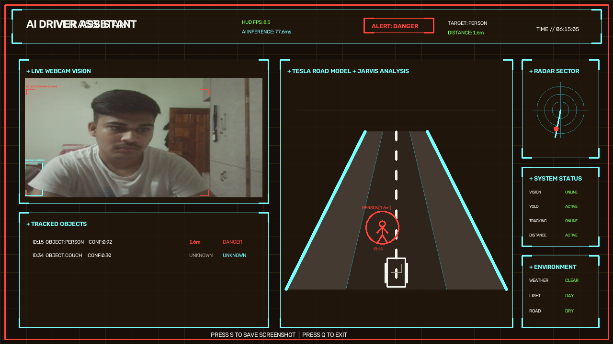

# Autonomous Traffic Sign & Hazard Detection System


A computer vision based AI driver assistance prototype that detects road objects, estimates approximate distance, tracks objects, shows risk levels, gives voice warnings, and displays everything inside a futuristic AI Driver Assistant dashboard.

> This project is built for learning, portfolio, and academic demonstration purposes only.  
> It should not be used as a real vehicle safety system.

---

## Dashboard Preview



## Dashboard Controls

```text
S = Save dashboard screenshot
V = Start / Stop dashboard video recording
Q = Exit dashboard
Esc = Exit dashboard
---

## Project Overview

This project combines object detection, distance estimation, object tracking, risk analysis, voice alerts, and a custom OpenCV dashboard UI.

The system uses a webcam to detect objects such as people, cars, buses, trucks, motorcycles, bicycles, traffic lights, and stop signs. It then estimates object distance, assigns a safety risk level, tracks the object across frames, and displays the result in a Tesla-style + Jarvis-style dashboard.

---

## Portfolio Highlights

- Built a real-time AI driver assistance prototype using Python, OpenCV, and YOLOv8
- Designed a custom futuristic dashboard interface using OpenCV
- Added object detection, object tracking, distance estimation, and risk classification
- Implemented voice warnings for danger-level detections
- Added screenshot and video recording support for project demonstrations
- Organized the project with clean folders, version history, and professional GitHub documentation


## Key Features

- Real-time webcam object detection
- YOLOv8 based road object detection
- Approximate distance estimation
- Risk levels: SAFE, WARNING, DANGER
- Object tracking with stable object IDs
- Smooth distance display
- Voice warning for danger risk
- Screenshot capture using the `S` key
- Tesla-style road model visualization
- Radar sector visualization
- Live webcam panel
- Tracked objects panel
- System status panel
- Environment panel
- Professional OpenCV dashboard interface

---

## Technologies Used

- Python
- OpenCV
- NumPy
- Ultralytics YOLOv8
- pyttsx3
- Object tracking logic
- Distance estimation logic
- Git and GitHub

---

## Project Structure

```text
Autonomous-Traffic-Sign-Hazard-Detection/
│
├── alerts/
│   ├── detection_logger.py
│   ├── voice_alert.py
│   └── voice_warning.py
│
├── dataset/
│
├── detectors/
│   ├── dashboard.py
│   ├── distance_estimator.py
│   ├── object_tracker.py
│   ├── object_detection.py
│   ├── driver_assistant.py
│   ├── lane_detector.py
│   ├── traffic_light_detector.py
│   ├── calibrate_distance.py
│   └── ground_distance_calibrator.py
│
├── docs/
│   └── images/
│       └── dashboard_demo.png
│
├── models/
│
├── notebooks/
│
├── outputs/
│   ├── screenshots/
│   └── detection_log.csv
│
├── src/
│
├── app.py
├── config.py
├── requirements.txt
├── yolov8n.pt
└── README.md

